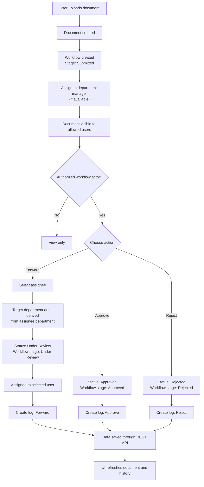

# Document Workflow

This file explains how the document workflow currently works in the application.

## Overview

The system tracks a document through upload, review, forwarding, approval, and rejection.

There are three main roles involved:

- `employee`: can upload documents and view documents they uploaded or that are assigned to them
- `manager`: can view documents in their own department, documents assigned to them, and documents they uploaded
- `admin`: can access all documents

Each document has:

- a `Document` record for metadata like title, description, file, department, status, and remarks
- a `Workflow` record for the current workflow stage and current assignee
- `DocumentLog` entries for the action history

## 1. Upload

When a user uploads a document:

1. A new `Document` is created.
2. The document department is resolved from:
   - the submitted department, or
   - the uploader's department
3. A `Workflow` record is created with:
   - `currentStage = Submitted`
   - `assignedTo = default manager of that department` if one exists
4. A `DocumentLog` entry is created with action `Upload`.

Result after upload:

- document status is `Submitted`
- workflow stage is `Submitted`
- the document is usually assigned to the manager of the selected department

## 2. Visibility Rules

### Who can see a document

- `admin`: can see every document
- `employee`: can see documents they uploaded or documents currently assigned to them
- `manager`: can see documents they uploaded, documents currently assigned to them, or documents in their own department

### Who can act on workflow

Workflow actions are allowed only for:

- `admin`
- the manager of the document's current department
- the currently assigned user

### Uploader UI restriction

On the document detail page, the uploader should not see:

- `Update Document Details`
- `Workflow Action`

This is now enforced in the frontend UI for the uploader view.

## 3. Update Document Details

Metadata update is separate from workflow actions.

Possible updates include:

- title
- description
- remarks
- uploaded file
- department

Important rules:

- the uploader can still have document ownership, but the uploader-facing UI hides the update section after upload
- department changes are restricted to:
  - `admin`
  - department manager
  - currently assigned user
- when department changes, the workflow assignee is reset to the manager of the new department if one exists

## 4. Workflow Actions

The system supports three workflow actions:

- `Forward`
- `Approve`
- `Reject`

### Forward

When a document is forwarded:

1. The document status becomes `Under Review`.
2. The workflow stage becomes `Under Review`.
3. If an assignee is selected:
   - the target department is automatically taken from that assignee's department
   - users cannot manually change the target department in the UI
   - the backend also enforces this rule
4. If no assignee is selected:
   - the provided target department is used
   - the workflow is assigned to that department's manager if one exists
5. A `DocumentLog` entry is created with action `Forward`.

### Approve

When a document is approved:

1. The document status becomes `Approved`.
2. The workflow stage becomes `Approved`.
3. A `DocumentLog` entry is created with action `Approve`.

### Reject

When a document is rejected:

1. The document status becomes `Rejected`.
2. The workflow stage becomes `Rejected`.
3. A `DocumentLog` entry is created with action `Reject`.

## 5. Remarks

Remarks are stored on the `Document` record.

- remarks can be updated during metadata update
- remarks can also be updated when performing a workflow action

This means the latest submitted remark is kept on the document itself.

## 6. Data Refresh

Whenever a document is uploaded, updated, forwarded, approved, rejected, or deleted, the backend updates the document, workflow, and log records through REST endpoints.

The document detail page refreshes after user actions and reloads:

- document data
- document history

## 7. History / Audit Trail

Every important workflow step creates a `DocumentLog` entry.

Examples:

- `Upload`
- `Forward`
- `Approve`
- `Reject`

The document detail page shows this history in the `Document History` table.

## Mermaid Workflow Diagram

